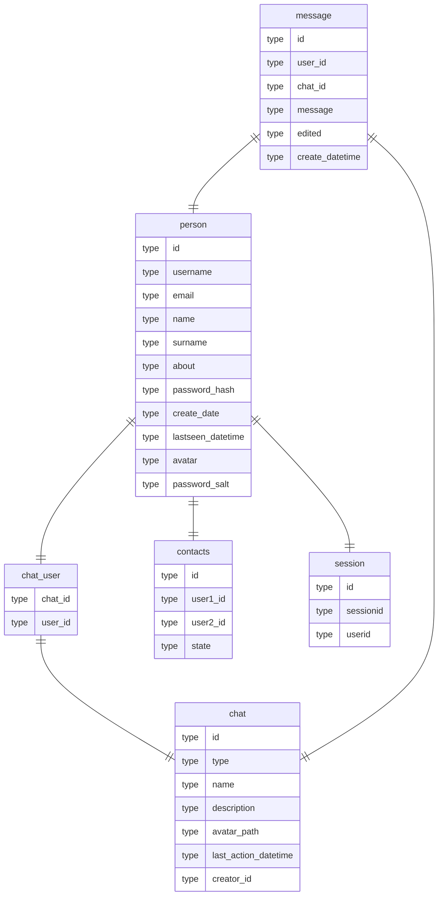

# Описание таблиц
## person 
Таблица, содержащая информацию о пользователях мессенджера. Включает в себя уникальный идентификатор пользователя (id), его имя (name), фамилию (surname), никнейм (username), адрес электронной почты (email), краткую информацию о себе (about), хэш пароля (password_hash) и соль для пароля (password_salt). Также включает в себя дату создания аккаунта (create_date) и дату последней активности (lastseen_datetime), а также ссылку на аватар пользователя (avatar).

## chat
Таблица, содержащая информацию о чатах в системе. Включает в себя уникальный идентификатор чата (id), его тип (type), имя (name), описание (description), путь к аватару чата (avatar_path), дату и время последнего действия в чате (last_action_datetime) и идентификатор создателя чата (creator_id).

## chat_user
Таблица, определяющая отношение многие ко многим между пользователями и чатами.

## message 
Таблица, содержащая информацию о сообщениях в чатах. Включает в себя уникальный идентификатор сообщения (id), идентификатор пользователя (user_id) и чата (chat_id), текст сообщения (message), флаг о том, было ли сообщение отредактировано (edited), а также дату и время создания сообщения (create_datetime).

## contacts
Таблица, представляющая связь многие ко многим между пользователями системы. Содержит уникальный идентификатор контакта (id), идентификаторы пользователей (user1_id и user2_id), указывающие на связь между двумя пользователями, а также состояние этой связи (state).

## session
Таблица, отслеживающая сеансы пользователей в системе. Включает в себя уникальный идентификатор сеанса (id), идентификатор сессии (sessionid) и идентификатор пользователя (userid), связанный с текущей сессией.

# ER диаграмма

