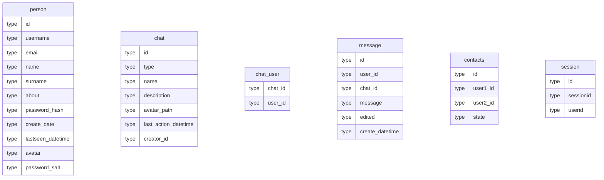

```mermaid
erDiagram
    
    person {
        type id
        type username
        type email
        type name
        type surname
        type about
        type password_hash
        type create_date
        type lastseen_datetime
        type avatar
        type password_salt
    }
    
    chat {
        type id
        type type
        type name
        type description
        type avatar_path
        type last_action_datetime
        type creator_id
    }
    
    chat_user {
        type chat_id
        type user_id
    }
    
    message {
        type id  
        type user_id
        type chat_id
        type message
        type edited
        type create_datetime
    }
    contacts {
        type id
        type user1_id
        type user2_id
        type state
    }
    
    session {
        type id
        type sessionid
        type userid
    }    
```
